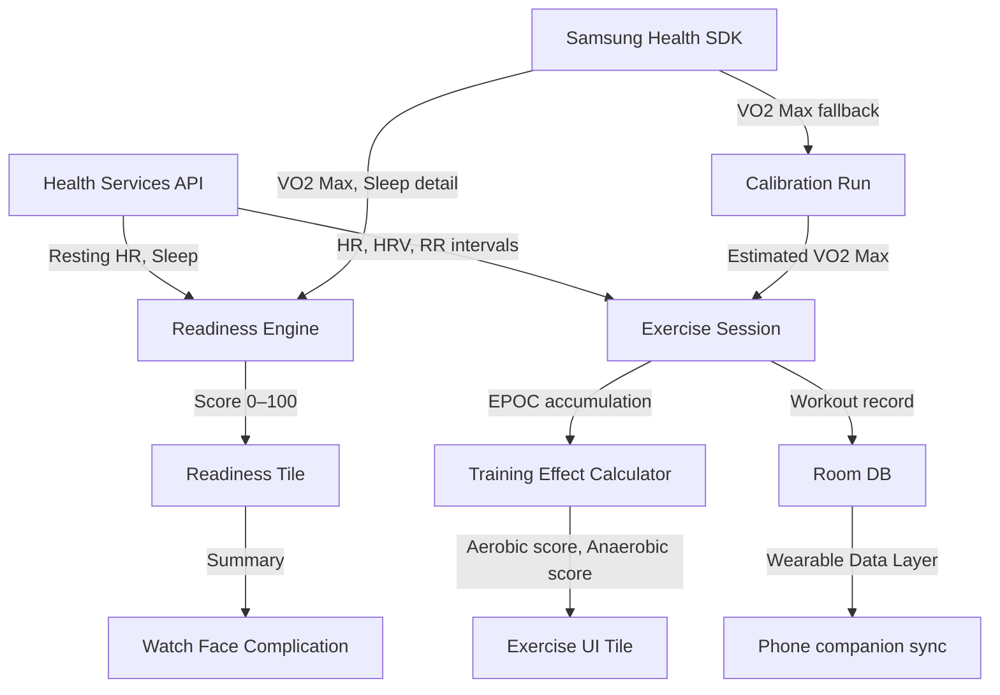

# Galaxy Watch Training Readiness & Real-Time Training Effect — Design Spec

> Wear OS app for Samsung Galaxy Watch 8 that surfaces exercise readiness
> (like Garmin Training Readiness) and real-time Training Effect score
> (like Garmin Aerobic/Anaerobic Training Effect) using Kotlin + Jetpack Compose.



---

## 1. Scope

Two features shipped as one Wear OS app:

| Feature | Garmin equivalent | When active |
|---|---|---|
| Exercise Readiness Score | Training Readiness / Body Battery | Always — tile + complication |
| Real-Time Training Effect | Aerobic/Anaerobic Training Effect | During exercise session only |

---

## 2. Platform & Tech Stack

| Layer | Choice | Reason |
|---|---|---|
| OS | Wear OS 4 (Galaxy Watch 8) | Native watch platform |
| Language | Kotlin | Only language with full Health Services API support |
| UI | Jetpack Compose for Wear OS | Google-recommended; simplifies real-time updating UI |
| Sensor API | Health Services API (primary) | Public, no partnership needed; real-time HR/HRV/calories |
| Sensor API | Samsung Health Sensor SDK (secondary) | HRV stress index, BIA — requires Samsung dev registration |
| Local DB | Room | Source of truth for readiness history + training load |
| Phone sync | Wearable Data Layer API | Survives watch reset; no cloud dependency |

---

## 3. Feature A — Exercise Readiness Score

### 3.1 Inputs

| Signal | Source | Weight |
|---|---|---|
| Morning HRV (RMSSD) | Health Services API — passive HR/RR measurement | 35% |
| Sleep duration + quality | Samsung Health SDK (sleep stages) | 30% |
| Acute training load (ATL, 7-day EWMA) | Room DB — past workouts | 20% |
| Resting HR trend (7-day) | Samsung Health SDK + Room DB | 15% |

### 3.2 Score Calculation

```
ReadinessScore (0–100) =
    (HRV_component × 0.35) +
    (Sleep_component × 0.30) +
    (ATL_component  × 0.20) +
    (RHR_component  × 0.15)
```

**HRV component:** compare today's morning RMSSD to the user's 30-day baseline.
- RMSSD ≥ baseline + 10% → 100
- RMSSD ≤ baseline − 20% → 0
- Linear interpolation between.

**Sleep component:**
- Duration: 7–9h → 100; <5h or >10h → 0; linear between.
- Quality: weight deep + REM proportion. Poor staging → penalty.

**ATL component (inverted — high load = lower readiness):**
- ATL = EWMA of Training Stress Score over 7 days.
- ATL < 30 → 100 (well rested); ATL > 100 → 0; linear between.

**RHR component:** compare today's resting HR to 7-day baseline.
- RHR ≤ baseline − 2 bpm → 100; RHR ≥ baseline + 5 bpm → 0.

### 3.3 Score Labels

| Range | Label | Color |
|---|---|---|
| 80–100 | Primed | Green |
| 60–79 | Ready | Teal |
| 40–59 | Moderate | Yellow |
| 20–39 | Low | Orange |
| 0–19 | Rest | Red |

### 3.4 Readiness Tile (detail view)

```
┌─────────────────────────────────┐
│  READINESS          78 / 100   │
│  ████████████████░░  Ready     │
│                                 │
│  HRV       ↑ 12%  above base  │
│  Sleep     7h 20m  Good        │
│  Load      Moderate  ATL 42    │
│  Resting HR  ↓ 1 bpm  Normal  │
│                                 │
│  [Start Workout]               │
└─────────────────────────────────┘
```

### 3.5 Watch Face Complication

Small complication showing score + color dot. Tapping opens the tile.

---

## 4. Feature B — Real-Time Training Effect

### 4.1 VO2 Max Sourcing (Decision 3)

Priority order at app startup:
1. Read from Samsung Health (`SamsungHealthDataTypes.VO2_MAX`) if available and < 90 days old.
2. Otherwise run auto-calibration: 12-minute run at steady pace; estimate VO2 max from HR + speed using the Uth–Sørensen–Overgaard–Pedersen formula.
3. User can also enter manually in settings.

### 4.2 EPOC-Based Training Effect Algorithm

Training Effect follows the Firstbeat EPOC model (open literature):

```
EPOC_rate = f(HR_reserve_%, VO2_max)
HR_reserve = (HR_current - HR_rest) / (HR_max - HR_rest)

Accumulated_EPOC += EPOC_rate × Δt   (updated every 5 seconds)

Aerobic_TE   = g(Accumulated_EPOC / VO2_max)   // 0.0–5.0
Anaerobic_TE = h(anaerobic_contribution)        // 0.0–5.0
```

Where `g()` and `h()` are piecewise linear functions mapping EPOC ratio to the 0–5 Garmin-equivalent scale.

HR max = 220 − age (editable in settings).
HR rest = measured by Health Services API passive session (nightly).

### 4.3 Training Effect Scale

| Score | Aerobic label | Benefit |
|---|---|---|
| 0.0–0.9 | No effect | — |
| 1.0–1.9 | Minor | Recovery |
| 2.0–2.9 | Maintaining | Maintains fitness |
| 3.0–3.9 | Improving | Improves aerobic base |
| 4.0–4.9 | Highly improving | Significantly improves |
| 5.0 | Overreaching | Risk of overtraining |

### 4.4 Exercise UI Screen

Updates every 30 seconds during active workout:

```
┌─────────────────────────────────┐
│  TRAINING EFFECT                │
│                                 │
│  Aerobic     2.3               │
│  ████████████░░░░░░░░          │
│                                 │
│  Anaerobic   0.8               │
│  ████░░░░░░░░░░░░░░░░          │
│                                 │
│  HR Zone  ❤️  Zone 3           │
│  Improving aerobic base        │
└─────────────────────────────────┘
```

Aerobic bar: blue gradient.
Anaerobic bar: orange gradient.
Benefit text: updates when score crosses a threshold.

---

## 5. Data Model (Room)

```kotlin
// Workout record — written at end of each session
@Entity data class WorkoutRecord(
    @PrimaryKey val id: UUID,
    val startTime: Instant,
    val durationSeconds: Int,
    val avgHrBpm: Int,
    val trainingStressScore: Float,   // TSS = f(duration, IF, FTP/VO2)
    val aerobicTE: Float,
    val anaerobicTE: Float,
    val peakEpoc: Float
)

// Daily readiness snapshot — written each morning after HRV measurement
@Entity data class ReadinessSnapshot(
    @PrimaryKey val date: LocalDate,
    val score: Int,
    val hrvRmssd: Float,
    val sleepHours: Float,
    val sleepQualityScore: Float,
    val atl: Float,
    val restingHrBpm: Int
)

// VO2 max record
@Entity data class Vo2MaxRecord(
    @PrimaryKey val measuredAt: Instant,
    val vo2Max: Float,
    val source: String   // "samsung_health" | "calibration" | "manual"
)
```

---

## 6. Phone Sync (Wearable Data Layer)

- After each workout: push `WorkoutRecord` as a `DataItem` to phone.
- Each morning: push `ReadinessSnapshot` to phone.
- Phone companion app stores to local Room on phone — survives watch factory reset.
- Sync is one-way: watch → phone. No cloud, no account required.

---

## 7. Permissions Required

```xml
<!-- Health Services -->
<uses-permission android:name="android.permission.BODY_SENSORS" />
<uses-permission android:name="android.permission.ACTIVITY_RECOGNITION" />

<!-- Samsung Health Sensor SDK -->
<uses-permission android:name="com.samsung.android.health.permission.READ" />

<!-- Wearable Data Layer -->
<uses-permission android:name="com.google.android.gms.permission.ACTIVITY_RECOGNITION" />
```

---

## 8. Key Open Questions

1. **HRV passive measurement timing** — Health Services API passive HR/RR sessions run continuously but battery life impact needs measurement. May need to restrict to a nightly 5-minute window.
2. **Samsung Health SDK partnership** — developer registration at [developer.samsung.com/health](https://developer.samsung.com/health) is required before submitting to Galaxy Store. Timeline unknown.
3. **EPOC formula coefficients** — the Firstbeat algorithm coefficients are not fully published. Will need to tune `g()` and `h()` against known reference workouts.

---

## 9. Out of Scope (v1)

- GPS / pace-based training load (indoor only for v1)
- Cloud sync or user account
- Social / sharing features
- Android phone companion UI (phone stores data only, no UI)
